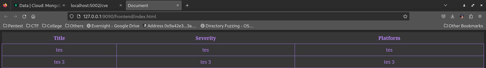
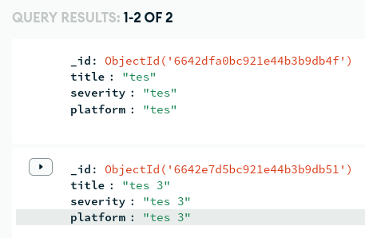
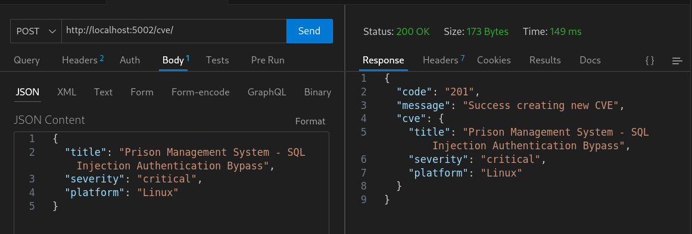
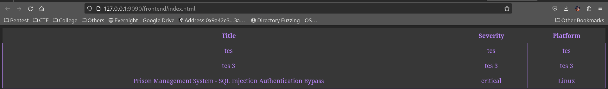
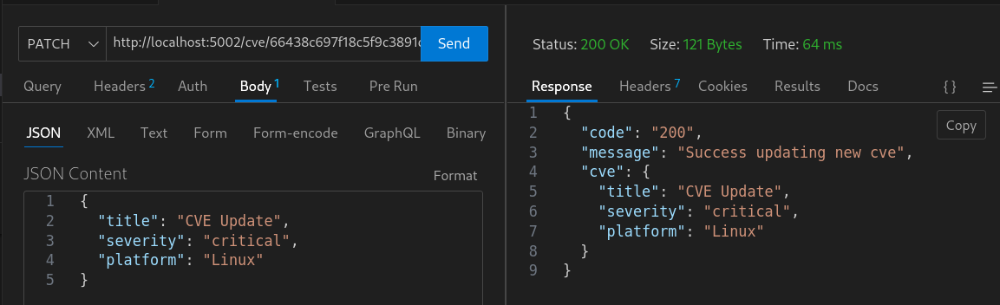
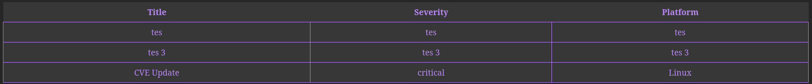
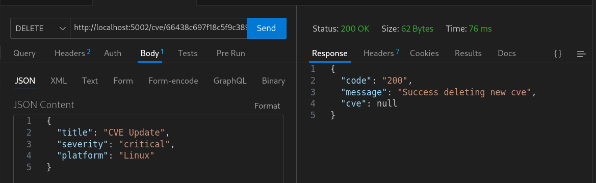
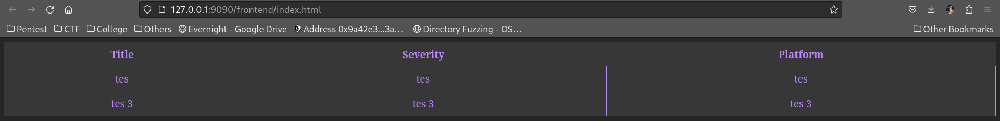

### protobuf/hacking.proto

```
syntax = "proto3";

package CVECatalog;

service CVECatalogService {
  rpc GetAllCVEs (Empty) returns (CVEs) {};
  rpc GetCVEByID (CVEID) returns (CVE) {};
  rpc AddCVE (CVE) returns (Response) {};
  rpc UpdateCVE (CVEWithID) returns (Response) {};
  rpc DeleteCVE (CVEID) returns (Response) {};
}

message CVE {
  string title = 2;
  string severity = 3;
  string platform = 4;
}

message CVEID {
  string id = 1;
}

message CVEs {
  repeated CVE cves = 1;
}

message CVEWithID {
  CVEID cveId = 1;
  CVE cve = 2;
}

message Response {
  string code = 1;
  string message = 2;
  CVE cve = 3;
}

message Empty {}

```

Script hacking.proto berisi protobuf, dalam script tersebut, terdapat 5 service yang didefine, yaitu GetAllCVEs, GetCVEByID, AddCVE, UpdateCVE, dan DeleteCVE. Secara umum, script protobuf hanya berisi service atau message yang perlu didefine.

### ./backend/src/server/index.ts
```
import * as grpc from '@grpc/grpc-js'
import * as protoLoader from '@grpc/proto-loader'
import { ProtoGrpcType } from '../proto/hacking'
import { CVECatalogServiceHandlers } from '../proto/CVECatalog/CVECatalogService'
import { Empty } from '../proto/CVECatalog/Empty'
import { CVEs } from '../proto/CVECatalog/CVEs'
import { CVE } from '../proto/CVECatalog/CVE'
import { databaseConnection } from './controller/db.controller'
import path from 'path'
import { cveServerController } from './controller/calendar.controller'
import { Response } from '../proto/CVECatalog/Response'
import { CVEWithID } from '../proto/CVECatalog/CVEWithID'
import { CVEID } from '../proto/CVECatalog/CVEID'

const PROTO_PATH: string = "../../../protobuf/hacking.proto"
const PORT: number = 8080
const options: protoLoader.Options = {
    keepCase: true,
    longs: String,
    enums: String,
    defaults: true,
    oneofs: true,
}

const protoBuf: protoLoader.PackageDefinition = protoLoader.loadSync(path.resolve(__dirname, PROTO_PATH), options)
const grpcObj: ProtoGrpcType = (grpc.loadPackageDefinition(protoBuf) as unknown) as ProtoGrpcType
const calendarService = grpcObj.CVECatalog

const main = () => {
    databaseConnection().then(() => {
        const server = getServer()
        server.bindAsync(`0.0.0.0:${PORT}`, grpc.ServerCredentials.createInsecure(),
            (err: Error | null, port: number) => {
                if (err) {
                    console.error(err.message)
                    return
                }
                console.log(`Server started on port ${port}`)

                server.start()
            }
        )
    })
}

const getServer = () => {
    const server: grpc.Server = new grpc.Server()
    server.addService(calendarService.CVECatalogService.service, {
        'GetAllCVEs': (call: grpc.ServerUnaryCall<Empty, CVEs>, callback: grpc.sendUnaryData<CVEs>) => {
            console.log('Server success get all Data')
            cveServerController.getAll().then((cves: CVEs | undefined) => {
                callback(null, cves)
            })
        },
        'AddCVE': (call: grpc.ServerUnaryCall<CVE, Response>, callback: grpc.sendUnaryData<Response>) => {
            const cve = call.request
            console.log('Server success Create Data')
            cveServerController.createcve(cve).then((res: Response | undefined) => {
                callback(null, res)
            })
        },
        'UpdateCVE': (call: grpc.ServerUnaryCall<CVEWithID, Response>, callback: grpc.sendUnaryData<Response>) => {
            const cve = call.request
            console.log('Server succeed get all Data')
            cveServerController.updatecve(cve).then((res: Response | undefined) => {
                callback(null, res)
            })
        },
        'DeleteCVE': (call: grpc.ServerUnaryCall<CVEID, Response>, callback: grpc.sendUnaryData<Response>) => {
            const cveId = call.request
            cveServerController.deletecve(cveId).then((res: Response | undefined) => {
                callback(null, res)
            })
        }
    } as CVECatalogServiceHandlers)
    return server
}

main()
```
Dalam script index.ts server, secara garis besar memulai service/dependencies yang diperlukan, seperti grpc-js dan lain-lain. Script ini menginisiasi koneksi database yang sudah di kofigurasi.

### ./backend/src/client/index.ts
```
import * as grpc from '@grpc/grpc-js';
import * as protoLoader from '@grpc/proto-loader';
import { ProtoGrpcType } from '../proto/hacking';
import path from 'path';
import { CVEID } from '../proto/CVECatalog/CVEID';
import { CVE } from '../proto/CVECatalog/CVE';
import express, { Request, Response } from 'express';
import { CVEWithID } from '../proto/CVECatalog/CVEWithID';
import authCors from '../middleware/authCors';

const PROTO_PATH: string = "../../../protobuf/hacking.proto";
const PORT: number = 8080;
const portClient = 5002

const options = {
    keepCase: true,
    longs: String,
    enums: String,
    defaults: true,
    oneofs: true,
};

const protoBuf = protoLoader.loadSync(path.resolve(__dirname, PROTO_PATH), options);
const grpcObj = grpc.loadPackageDefinition(protoBuf) as unknown as ProtoGrpcType;

const client = new grpcObj.CVECatalog.CVECatalogService(
    `0.0.0.0:${PORT}`, grpc.credentials.createInsecure()
);

const deadline = new Date();
deadline.setSeconds(deadline.getSeconds() + 5);
client.waitForReady(deadline, (err: any) => {
    if (err) {
        console.error(err);
        return;
    }
    onClientReady();
});

const onClientReady = () => {
    console.log(`Server running on port ${PORT} & Client running on port ${portClient}`);
    const app = express();
    app.use(authCors)
    app.use(express.json());

    app.get('/cve', (req: Request, res: Response) => {
        client.GetAllCVEs({}, (err: any, _res: any) => {
            if (err) {
                console.error(err);
                return;
            }
            res.send(_res);
        });
    });

    app.post('/cve', (req: Request, res: Response) => {
        const createInput: CVE = req.body;
        const cve: CVE = createInput;
        client.AddCVE(cve, (err: any, _res: any) => {
            if (err) {
                console.error(err);
                return;
            }
            res.send(_res);
        });
    });

    app.patch('/cve/:id', (req: Request, res: Response) => {
        const cve: CVEWithID = {
            cveId: {
                id: req.params.id
            },
            cve: req.body
        }

        client.UpdateCVE(cve,
            (err: any, _res: any) => {
                if (err) {
                    console.error(err)
                    return
                }
                res.send(_res)
            }
        )
    })

    app.delete('/cve/:id', (req: Request, res: Response) => {
        const cveID: CVEID = { id: req.params.id };
        client.DeleteCVE(cveID, (err: any, _res: any) => {
            if (err) {
                console.error(err);
                return;
            }
            res.send(_res);
        });
    });

    app.listen(portClient, () => {
        console.log("Express is started");
    });
};
```
index.ts yang berada dalam client, merupakan sebuah script yang ditulis dengan menggunakan express javascript. Script ini memiliki inti topik, yakn pada bagian routes yang sudah dikonfigurasi untuk tiap action/method yang dilakukan oleh user.


### ./frontend/main.js
```
const display = document.querySelector('#cve tbody')

async function fetchData() {
    try {
        const res = await fetch('http://localhost:5002/cve');
        const data = await res.json();
        const results = data.cves;
        console.log(results);
        display.innerHTML = '';

        results.map((item) => {
            
            const row = document.createElement('tr');
            const titleCell = document.createElement('td');
            titleCell.textContent = item.title;
            row.appendChild(titleCell);

            const severityCell = document.createElement('td');
            severityCell.textContent = item.severity;
            row.appendChild(severityCell);

            const platformCell = document.createElement('td');
            platformCell.textContent = item.platform; 
            row.appendChild(platformCell);

            display.appendChild(row);
        });
    } catch (error) {
        console.error('Error fetching data:', error);
    }
}

fetchData()
```
Dikarenakan script ini merupakan dasar yang penting untuk index.html. Pada script ini, digunakan untuk melalukan mapping terhadap data yang berada di dalam database.

### Dokumentasi

Berikut merupakan UI untuk pertama kali dengan 2 data sebagai contoh

Dan ini merupakan tampilan starter di mongodb


Pada proses create, hanya dibutuhkan request method get pada direktori /cve


Pada tampilan UI, dapat dilihat bahwa data sudah bertambah


Kemudian, yakni method update menggunakan request method PATCH



Terakhir, yaitu method delete menggunakan request method DELETE



Sekian dan terima kasih
